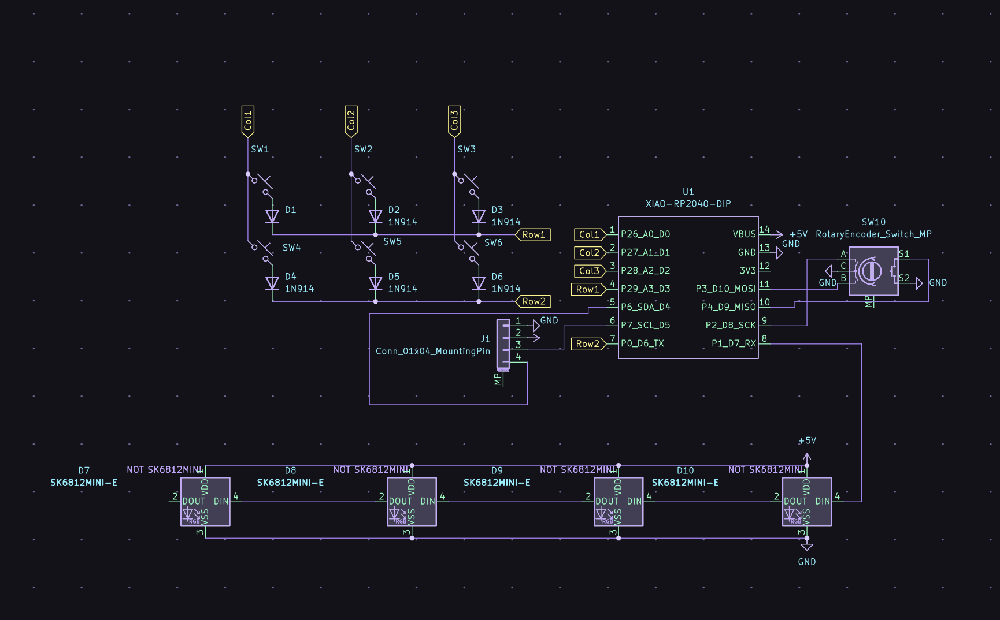
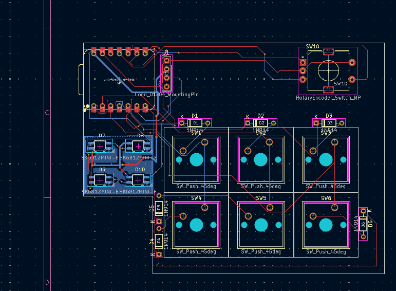

# Macropad v1

## Features
- 6 Switches
- 1 Rotary knob 
- 4 LEDs
- 1 OLED 32x128

## Specifications
BOM:
- 6x Cherry MX Switches
- 7x Blank DSA 1.00u keycaps
- 4x SK6812 MINI E Neopixels
- 1x EC11 Rotary Encoder - RotaryEncoder_Switch
- 1x Rotary knob
- 1x XIAO RP2040
- 6x M3x5mx4mm heatset insert
- 6x M3x16mm screws

## Firmware Overview  

The firmware of this macropad was made using KMK.

### Schematics

### PCB

### Case

